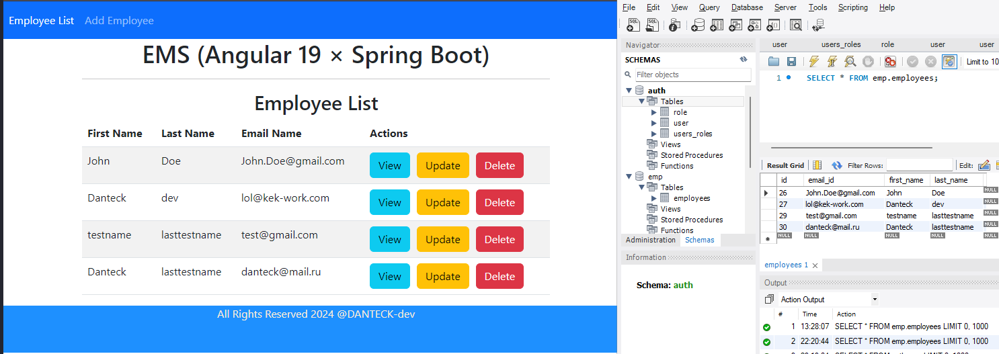
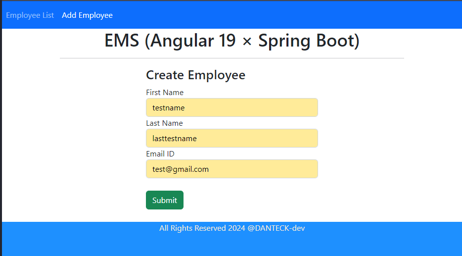
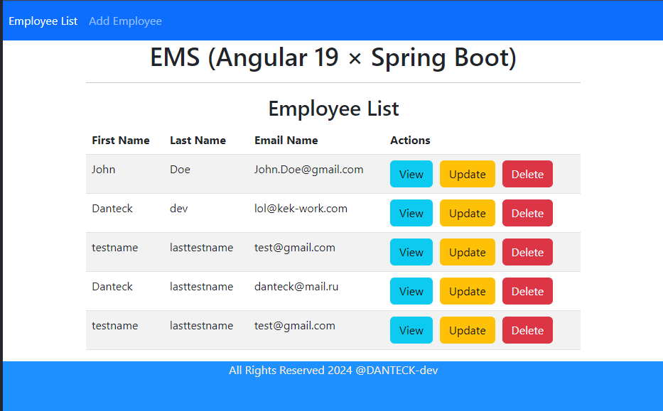
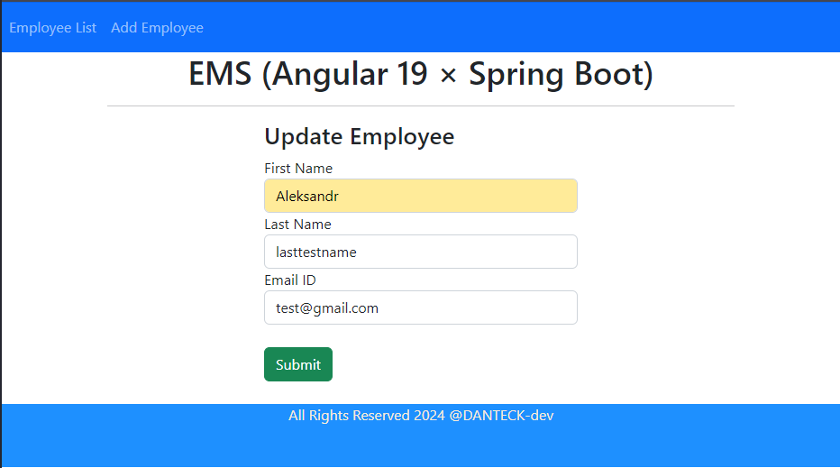
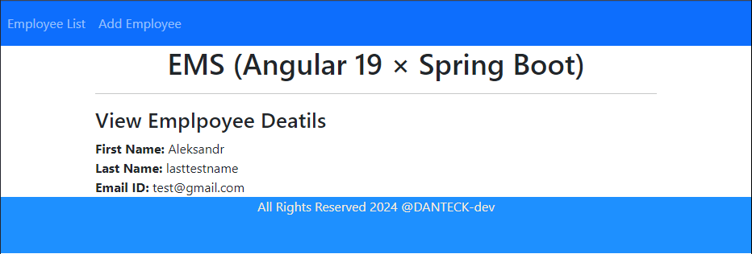
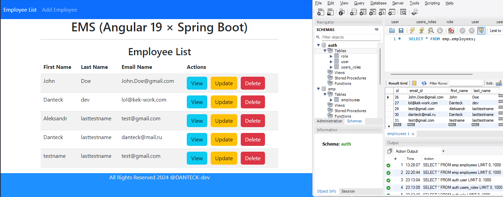

# Employee Management System (EMS) Frontend (Angular)

## Описание проекта

Данное приложение представляет собой систему управления сотрудниками. Оно позволяет:
- Просматривать список сотрудников.
- Добавлять новых сотрудников.
- Редактировать данные существующих сотрудников.
- Удалять сотрудников.

>Ссылка на [Backend](https://github.com/DANTECK-dev/EMS_Backend_SpringBoot)

### Стек технологий:
- **Frontend**: Angular, Bootstrap.
- **Backend**: Spring Boot, REST API.
- **База данных**: MySQL.

## Установка и запуск

### Backend

1. Убедитесь, что у вас установлены:
   - **Java 21** или выше.
   - **Maven**.

2. Склонируйте репозиторий:
   ```bash
   git clone <ссылка-на-репозиторий>
   ```

3. Настройте подключение к базе данных в `application.properties`:
   ```properties
   spring.datasource.url=jdbc:mysql://localhost:3306/employee_db
   spring.datasource.username=ваш_пользователь
   spring.datasource.password=ваш_пароль
   spring.jpa.hibernate.ddl-auto=update
   ```

4. Запустите backend-приложение:
   ```bash
   mvn spring-boot:run
   ```

### Frontend

1. Убедитесь, что у вас установлены:
   - **Node.js** и **npm**.

2. Перейдите в директорию frontend:
   ```bash
   cd angular-frontend
   ```

3. Установите зависимости:
   ```bash
   npm install
   ```

4. Запустите frontend-приложение:
   ```bash
   npm start
   ```

5. Откройте браузер и перейдите по адресу:
   ```
   http://localhost:4200
   ```

## Основные функции

- **Просмотр сотрудников**: Список всех сотрудников отображается с возможностью поиска.
- **Добавление сотрудников**: Форма для ввода имени, email и других данных сотрудника.
- **Редактирование сотрудников**: Форма для изменения данных существующего сотрудника.
- **Удаление сотрудников**: Подтверждение перед удалением сотрудника.

## Основные API эндпоинты

- **GET /api/employees**: Получение списка сотрудников.
- **POST /api/employees**: Добавление нового сотрудника.
- **PUT /api/employees/{id}**: Редактирование данных сотрудника.
- **DELETE /api/employees/{id}**: Удаление сотрудника.

## Скриншоты
### Главная страница


### Добавление сотрудника


### Сотрудник добавлен


### Редактирование сотрудника


### 'Подробное описание' сотрудника


### Новый список сотрудников


## Требования

- **Backend**:
  - Java 21 или выше.
  - Maven.
  - MySQL.

- **Frontend**:
  - Node.js.
  - Angular CLI.

### Автор
- Cтудент **Александр Немеров**
- Вуз **ВСГУТУ**
- Группа **Б761-2**
- Связь **lol@kek-work.ru**

### Лицензия
Проект распространяется под лицензией [MIT LICENSE](LICENSE).
